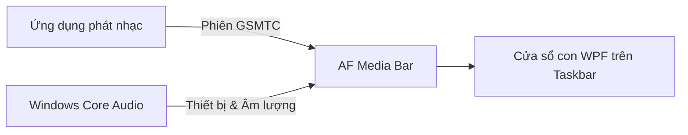

> **Bản Việt hóa dựa trên dự án gốc của [Fervent-Tempo](https://github.com/Fervent-Tempo/AF-Media-Bar)**

<p align="center">
  
</p>

<p align="center">
  <a href="https://github.com/Fervent-Tempo/AF-Media-Bar/releases"></a>
  <a href="https://github.com/Fervent-Tempo/AF-Media-Bar/releases"></a>
  <a href="LICENSE"></a>
  <br>
  Tiếng Việt · <a href="README.en-US.md">English</a> · <a href="https://github.com/Fervent-Tempo/AF-Media-Bar/blob/main/README.md">简体中文</a>
  <br>
  <a href="#tải-về-và-cài-đặt">Tải về & Cài đặt</a> · <a href="#tính-năng-nổi-bật">Tính năng</a> · <a href="https://github.com/Fervent-Tempo/AF-Media-Bar/issues/new?template=bug_report.yml">Báo lỗi</a> · <a href="https://github.com/Fervent-Tempo/AF-Media-Bar/issues/new?template=feature_request.yml">Đề xuất tính năng</a>
</p>

AF Media Bar là một trình điều khiển phương tiện di động dành cho thanh tác vụ (Taskbar) trên Windows 10/11. Ứng dụng đọc phiên phát phương tiện từ hệ thống để đưa ảnh bìa, lời bài hát, các nút điều khiển phát nhạc và chuyển đổi thiết bị âm thanh trực tiếp ra mép màn hình desktop của bạn.

## Trải nghiệm thực tế

<p align="center">
  
</p>

[Xem video giới thiệu trên Bilibili](https://www.bilibili.com/video/BV17yhh6aEgK)

## Tải về và cài đặt

Truy cập [GitHub Releases](https://github.com/Fervent-Tempo/AF-Media-Bar/releases) và lựa chọn một phương thức:

1. **Bản cài đặt (Khuyên dùng):** Tải về `AFMediaBar-Setup-vX.Y.Z-win-x64.exe`, chạy trình hướng dẫn để chọn ngôn ngữ, vị trí cài đặt và chế độ người dùng hiện tại / tất cả người dùng. Vị trí cài đặt mặc định là `%LOCALAPPDATA%\Programs\AFMediaBar`; phiên bản cài đặt hỗ trợ kiểm tra, tải về và cài đặt cập nhật trực tiếp trong ứng dụng.
2. **Bản di động (Portable):** Tải về `AFMediaBar-vX.Y.Z-win-x64.zip`, giải nén vào thư mục cố định có quyền ghi (ví dụ: `D:\AFMediaBar`), sau đó chạy tệp `AFMediaBar.exe`. Bản di động không ghi vào Registry; khi cập nhật chỉ cần thay thế các tệp thủ công.

**Yêu cầu hệ thống:** Windows 10 phiên bản 1809 (Build 17763) trở lên phiên bản 64-bit (x64), kèm theo Microsoft Edge WebView2 Runtime. Windows 11 và các bản Windows 10 còn được hỗ trợ thông thường đã được cài sẵn; với các bản Windows rút gọn (Lite) nếu thiếu cần cài đặt Evergreen Runtime trước. Cả hai gói phát hành đều đã tích hợp sẵn .NET Runtime, không cần cài đặt thêm. Các giao diện hệ thống mà ứng dụng sử dụng có sẵn từ bản 1809, tuy nhiên **.NET 10 chính thức chỉ hỗ trợ các phiên bản Windows 10 Kênh dịch vụ dài hạn (LTSC) và Enterprise** (1809 E, 21H2 E); các bản Windows 10 dành cho người dùng cá nhân (Home/Pro) không nằm trong phạm vi hỗ trợ chính thức của Microsoft. Windows 11 hoàn toàn không bị ảnh hưởng bởi giới hạn này.

Vui lòng tải các gói phát hành được nêu ở trên, không tải tệp mã nguồn (Source code) tự động nén của GitHub. Ứng dụng hiện chưa có chữ ký số thương mại nên trong lần chạy đầu tiên, Windows SmartScreen có thể hiển thị cảnh báo "Nhà phát hành không xác định" (Unknown Publisher).

## Tính năng nổi bật

| Phân loại | Khả năng đáp ứng |
| --- | --- |
| Điều khiển phát nhạc | Bài trước, Phát/Tạm dừng, Bài tiếp, Lặp lại; nhấp chuột hoặc kéo thanh tiến trình để tua nhanh/chậm. |
| Lời bài hát trên thanh tác vụ | Hiển thị lời bài hát thời gian thực thông qua engine lời bài hát Web, hỗ trợ dịch thuật, phiên âm và căn chỉnh hai dòng; tự động tìm kiếm theo thứ tự: NetEase Cloud Music, LRCLIB, QQ Music, Kugou Music, Soda Music |
| Nguồn phát & Tương tác | Chuyển đổi qua lại giữa các phiên phát phương tiện; hành vi nhấp chuột vào ảnh bìa, tiêu đề và lời bài hát có thể tùy chỉnh độc lập thành Phát/Tạm dừng, chuyển sang ứng dụng phát hoặc mở menu đầy đủ |
| Âm thanh & Hệ thống | Nhấp chuột hoặc lăn con trỏ để chuyển đổi thiết bị phát mặc định, điều chỉnh âm lượng của ứng dụng phát hiện tại, xem trạng thái âm thanh không gian (Spatial Audio); cung cấp 4 kiểu hiệu ứng sóng âm (Spectrum) và thành phần theo dõi hiệu năng hệ thống |
| Bố cục & Giao diện | Tự động tránh vùng icon tác vụ và khay hệ thống, tùy chọn màn hình hiển thị, tự động ẩn khi không có nhạc phát; tùy chỉnh phông chữ, màu nhấn (Accent color) và chất liệu cửa sổ |
| Thao tác nhanh | Di chuột để hiển thị các nút điều khiển, mở lớp chi tiết đầy đủ để xem thêm thông tin; nhấp vào biểu tượng nốt nhạc để mở danh sách khởi động nhanh; chuyển đổi nhanh thiết bị đầu ra âm thanh |

**Phạm vi và giới hạn:** Chỉ các trình phát phát hành phiên phương tiện GSMTC lên Windows mới xuất hiện; một số trình phát yêu cầu bật tính năng "Điều khiển phương tiện hệ thống" hoặc "Phím đa phương tiện" trong phần cài đặt của chính ứng dụng đó. Hiện tại ứng dụng chỉ có chế độ chạy trên thanh tác vụ (Taskbar); các tùy chọn Dynamic Island, Thẻ trên màn hình nền (Desktop Card) và Bóng nổi (Floating Orb) trong Cài đặt hiện là các mục đang phát triển (placeholder).

## Cơ chế hoạt động

AF Media Bar hoạt động như một tiến trình WPF độc lập, gắn thanh điều khiển phương tiện làm cửa sổ con của thanh tác vụ Windows. Ứng dụng sử dụng API GSMTC công khai của Windows để đọc phiên phương tiện và Windows Core Audio để xử lý thiết bị cùng mức âm lượng, hoàn toàn không chỉnh sửa hay tiêm mã (inject) vào `explorer.exe`.



Các ứng dụng như NetEase Cloud Music, QQ Music, Spotify, trình duyệt web,... chỉ cần phát hành phiên phương tiện hệ thống là có thể được nhận diện và điều khiển. Thẻ phương tiện trong Trung tâm điều khiển của Windows không phải là một control có thể nhúng trực tiếp; dự án này đọc các API công khai phía sau nó và tự hiển thị giao diện riêng trên thanh tác vụ.

## Cập nhật và Gỡ cài đặt

### Cập nhật

Khoảng 20 giây sau khi khởi động, ứng dụng sẽ đọc danh sách phiên bản công khai (`docs/latest.json`). Khi phát hiện có bản cập nhật mới: biểu tượng khay hệ thống sẽ hiển thị một thông báo hệ thống, nhấp vào sẽ mở thẳng trang «Ứng dụng».
Bản di động (Portable) không có hồ sơ cài đặt, nên chỉ hỗ trợ tải về chứ không tự cài đặt đè.

Nhật ký cài đặt được lưu tại `%LOCALAPPDATA%\AFMediaBar\updates\install-<phiên_bản>.log`; tệp cài đặt đã tải về nằm trong cùng thư mục và sẽ được dọn dẹp theo phiên bản trong lần khởi động kế tiếp.

Cấu hình tùy chọn và trạng thái cửa sổ của người dùng được lưu tại `%LOCALAPPDATA%\AFMediaBar\settings.json`. Việc cập nhật/thay thế tệp chương trình trong cùng một phiên bản sẽ không làm mất cài đặt; bạn có thể mở thư mục cấu hình từ trang «Ứng dụng».

### Gỡ cài đặt

- Bản di động (Portable): Xóa trực tiếp thư mục chứa chương trình.
- Bản cài đặt (Installer): Gỡ cài đặt trong phần “Cài đặt > Ứng dụng > Ứng dụng đã cài đặt” của Windows hoặc dùng lối tắt gỡ cài đặt trong Start menu. Thao tác gỡ cài đặt chỉ xóa thư mục chương trình và các phím tắt; nếu muốn xóa sạch toàn bộ dữ liệu cấu hình `%LOCALAPPDATA%\AFMediaBar`, bạn có thể thực hiện thủ công hoặc chạy lệnh sau:

```powershell
Remove-Item "$env:LOCALAPPDATA\AFMediaBar" -Recurse -Force
```

## Quyền riêng tư và Bảo mật

- Hoàn toàn không chứa mã thu thập dữ liệu từ xa (telemetry), quảng cáo, hệ thống tài khoản hay phân tích hành vi người dùng; thông tin bài hát, chỉ số hệ thống và các thao tác âm lượng đều được xử lý nội bộ 100% trên máy của bạn.
- Việc kiểm tra cập nhật chỉ gửi yêu cầu tới hai địa chỉ danh sách công khai (`raw.githubusercontent.com` và jsDelivr tại đường dẫn `docs/latest.json`).
- Lời bài hát được truy vấn dựa trên thông tin bài hát hiện tại tới các API công khai của năm nguồn trên (mỗi nguồn gửi một yêu cầu duy nhất, dừng lại ngay khi tìm thấy kết quả); các yêu cầu này chỉ gửi tên bài hát, nghệ sĩ, album và thời lượng.
- Ứng dụng chạy dưới quyền của người dùng hiện tại (Standard User), không yêu cầu quyền Quản trị viên (Administrator). Các vấn đề liên quan đến bảo mật vui lòng báo cáo riêng tư theo hướng dẫn trong [SECURITY.md](SECURITY.md).

## Biên dịch từ mã nguồn

Yêu cầu Windows 10 1809 trở lên, [.NET 10 SDK](https://dotnet.microsoft.com/download/dotnet/10.0) và PowerShell; kho lưu trữ cố định dải tính năng SDK được hỗ trợ thông qua tệp `global.json`.

```powershell
git clone https://github.com/tienwopa/AF-Media-Bar_VIE.git
cd AF-Media-Bar_VIE
dotnet restore .\src\AFMediaBar.slnx
dotnet build .\src\AFMediaBar.slnx -c Release --no-restore
dotnet test .\src\AFMediaBar.slnx -c Release --no-build
dotnet run --project .\src\AFMediaBar\AFMediaBar.csproj
```

Tạo tệp thực thi đơn lẻ (self-contained single-file) cho người dùng cuối:

```powershell
dotnet publish .\src\AFMediaBar\AFMediaBar.csproj -c Release -r win-x64 --self-contained true -o .\artifacts\AFMediaBar-win-x64
```

## Cấu trúc dự án

```text
AF-Media-Bar/
├── .github/workflows/        # Quy trình build và phát hành (CI/CD workflows)
├── src/AFMediaBar/           # Dự án ứng dụng WPF chính
│   ├── Classes/              # Mã nguồn phân tầng nghiệp vụ
│   │   ├── Abstractions/     # Giao diện và hợp đồng liên mô-đun
│   │   ├── Interop/          # Tương tác với Windows API (P/Invoke)
│   │   ├── Models/           # Mô hình dữ liệu (bao gồm schema bố cục)
│   │   ├── Services/         # Các dịch vụ độc lập theo nghiệp vụ (Media, Lyrics, Audio, Updates…)
│   │   ├── Settings/         # Mô hình cấu hình và facade tương thích
│   │   └── Utils/            # Tiện ích không trạng thái và bộ nhớ đệm có giới hạn
│   ├── Components/           # Các thành phần điều khiển (WPF Controls) tái sử dụng
│   ├── Resources/            # Giao diện, kiểu dáng và tài nguyên ngôn ngữ
│   ├── ViewModels/           # Mô hình dạng xem (MVVM ViewModels)
│   └── Views/                # Các trang giao diện và cửa sổ chứa
├── tests/AFMediaBar.Layout.Tests/   # Kiểm thử logic, chính sách và cấu hình
├── tools/                    # Công cụ phân tích tĩnh kiến trúc và script hỗ trợ
├── installer/                # Kịch bản đóng gói cài đặt Inno Setup
└── docs/                     # Tài liệu dự án, tài nguyên và danh sách phiên bản
```

## Đóng góp

Vui lòng đọc kỹ [CONTRIBUTING.md](CONTRIBUTING.md) trước khi gửi lỗi hoặc yêu cầu kéo (Pull Request). Báo cáo lỗi xin vui lòng đính kèm phiên bản Windows, phiên bản AF Media Bar, ứng dụng phát nhạc đang dùng và các bước tái hiện chi tiết. Lịch sử thay đổi các phiên bản có thể xem tại [CHANGELOG.md](CHANGELOG.md).

## Lời cảm ơn

Xin gửi lời cảm ơn chân thành đến tất cả các nhà phát triển đã đóng góp cho dự án.

Đặc biệt cảm ơn các dự án nguồn mở sau:

- [FluentFlyout](https://github.com/unchihugo/FluentFlyout)
- [Lyricify-Lyrics-Helper](https://github.com/WXRIW/Lyricify-Lyrics-Helper)
- [TaskbarLyrics](https://github.com/ANYNC/TaskbarLyrics)

## Giấy phép

AF Media Bar được phát hành theo giấy phép nguồn mở [MIT License](LICENSE).

<div align="center">

Nếu bạn thấy AF Media Bar hữu ích, đừng ngần ngại tặng cho dự án một ngôi sao Star ❤️ nhé!

</div>

## Tài trợ

Mời tác giả gốc một tách cà phê. **Khoản ủng hộ trên 10 Nhân dân tệ có thể được ghi danh vào danh sách nhà tài trợ — vui lòng để lại ID của bạn trong ghi chú thanh toán.**

<div align="center">

| WeChat Pay | Alipay |
| :---: | :---: |
|  |  |

Trang tài trợ Afdian: [Afdian](https://ifdian.net/a/amorfate)

</div>
